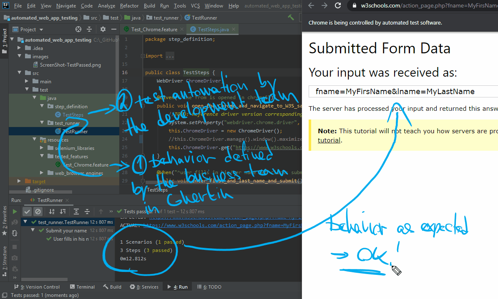

# Automated Web App Testing
This project is a package of all components needed to run automated tests of web applications on Selenium and Cucumber with a small demonstrative test case (submitting data through a [W3Schools](https://www.w3schools.com/html/html_forms.asp) sample form). 

This App was produced during my master degree Software Design and Engineering at [University of Applied Sciences FH Campus Wien](https://www.fh-campuswien.ac.at/en/studies/study-courses/detail/software-design-and-engineering-master.html).

## Prerequisites
Import as maven project - all dependencies are included. The example runs on Chrome 80.

## Execution
Run TestRunner. Demo: 

## License
This application is released under the MIT license. 